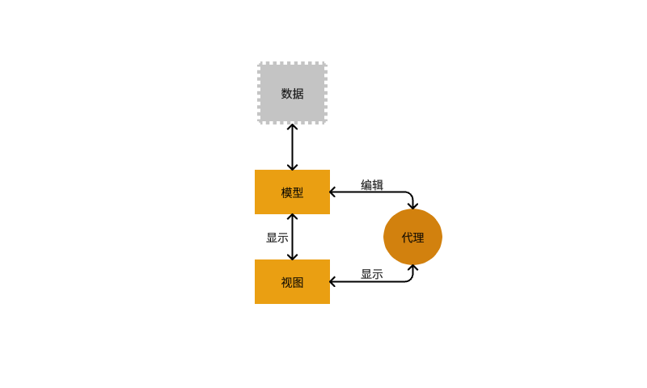
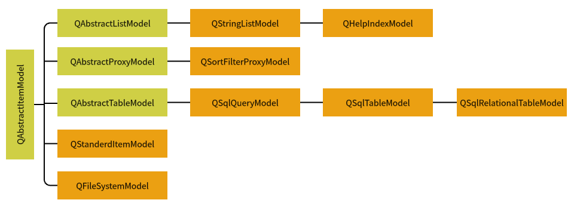
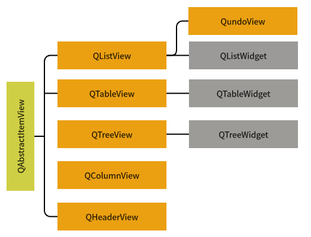

# QT:模型/视图结构

## 基本概述
* `数据（data）`：如数据库的一个数据表或SQL查询结果，内存中的一个字符串，或磁盘文件结构等。
* `模型（model）`：与数据通信，并为视图组件提供数据接口。
* `视图（view）`：是屏幕上的界面组件，视图从数据模型获得每个数据项的模型索引（model index），通过模型索引获取数据。
* `代理（delegate）`：在视图与模型之间交互操作时提供的临时编辑器。编辑项视图提供数据是单向的，一般仅用于显示。当需要在视图上编辑数据时，代理会为需要编辑的数据提供一个编辑器。 
    
&emsp;&emsp;**注意：** 模型、视图和代理之间使用信号与槽通信 
&emsp;&emsp; * 所有的基于项（item）的模型类都基于`QAbstractItemModel` 
&emsp;&emsp; * 模型只在内存临时存储数据，模型的数据来源可以是其他类、文件、数据库。 
#### QAbstractItemModel类的继承关系图
    
#### QAbstractItemView类的继承关系图
    
## 
